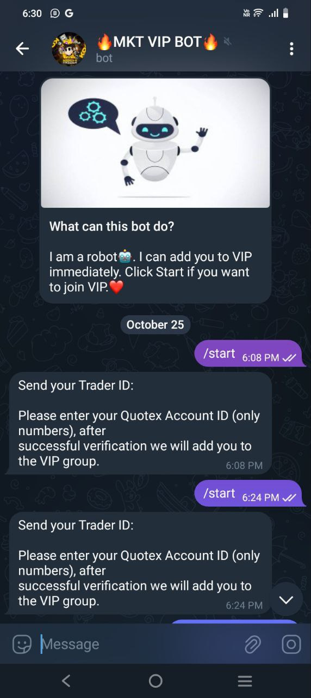
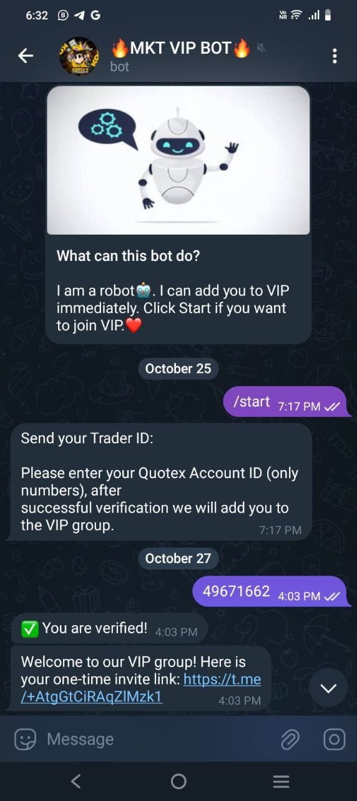
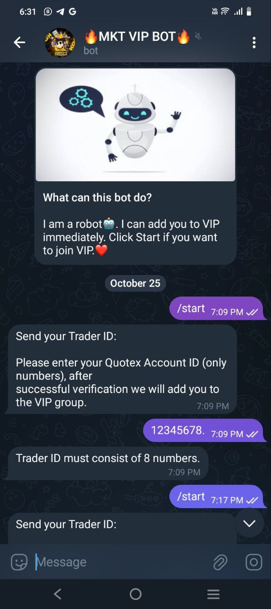

# Quotex Verification Bot

This is a Telegram bot built for verifying Quotex users. The bot allows users to submit their Quotex ID, get a verification queue position, and receive an estimated response time. The bot is designed to streamline the verification process and prevent duplicate submissions by guiding users through a straightforward workflow.

## Features

- **User-Friendly Verification Process**: Simplifies Quotex ID verification with clear instructions.
- **Queue Management**: Provides users with a queue position and an estimated response time.
- **Anti-Spam**: Informs users not to send multiple messages, reducing bot spam.
- **Admin Commands**: Includes admin-only features for managing the bot efficiently.

## Screenshots

| Bot /start | Not Linked | Linked But Not Have Required Balance | All Are Verified  |
|---------------|---------------|----------------|----------------|
|  |  |  |  |
