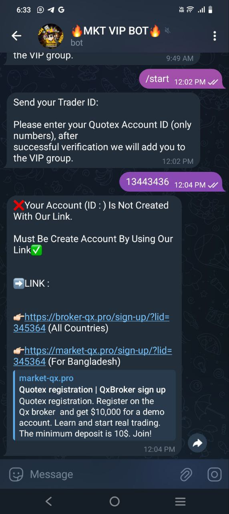

# Quotex Verification Bot

This is a Telegram bot built for verifying Quotex users. The bot allows users to submit their Quotex ID, get a verification queue position, and receive an estimated response time. The bot is designed to streamline the verification process and prevent duplicate submissions by guiding users through a straightforward workflow.

## Features

- **User-Friendly Verification Process**: Simplifies Quotex ID verification with clear instructions.
- **Queue Management**: Provides users with a queue position and an estimated response time.
- **Anti-Spam**: Informs users not to send multiple messages, reducing bot spam.
- **All Verification It Will Do**: Includes All features for managing the bot efficiently.

## Screenshots

| Bot /start | Not Linked | Linked But Not Have Required Balance | All Are Verified  |
|---------------|---------------|----------------|----------------|
|  |  |  |  |
 This is a work of bot and you can change your bot message according to you need

## Want Bot
If you need this bot then contact https://t.me/SiddhantDevelopers
Price is just 30$ With Server is free for you.

#The process will work as follows:
The user will send their user ID to the bot. If the user ID was obtained through your referral link and their account has the required balance, the bot will respond by sending a unique, private link to the user. This link will be accessible to only that user.
